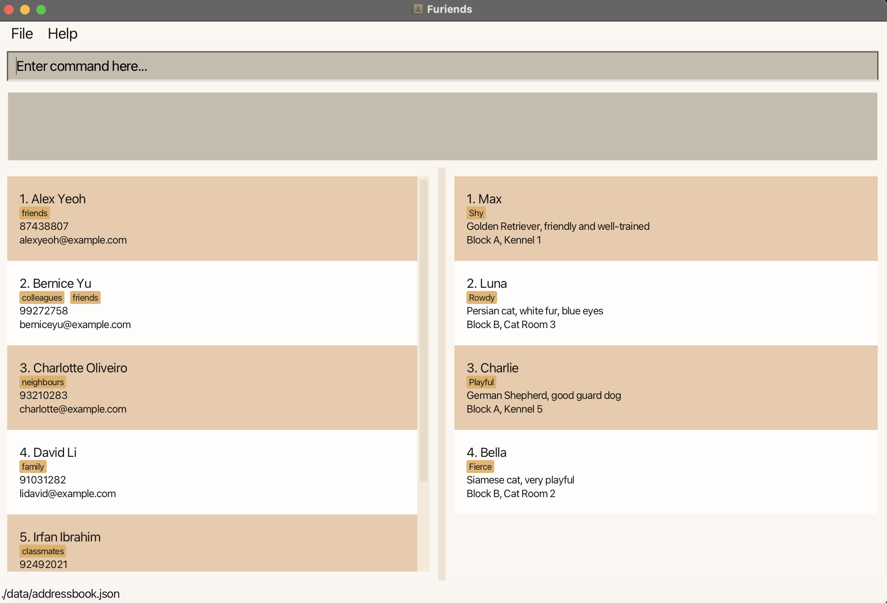
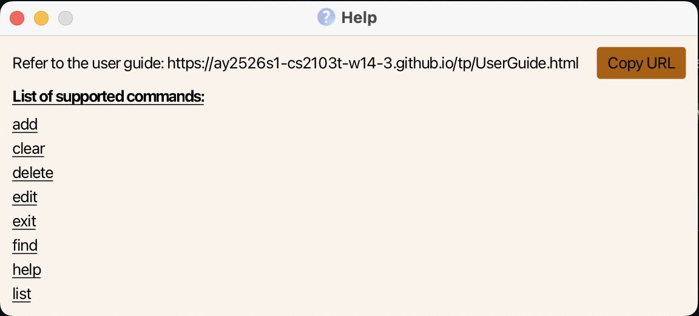
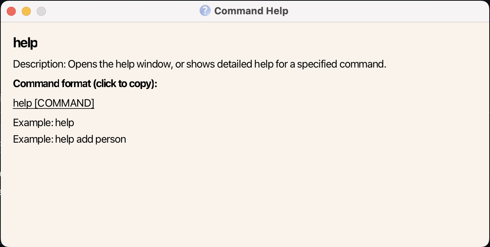
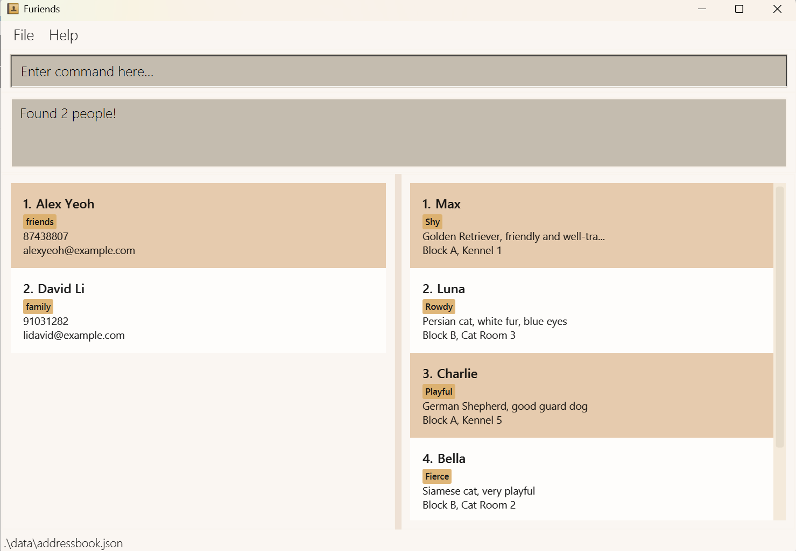
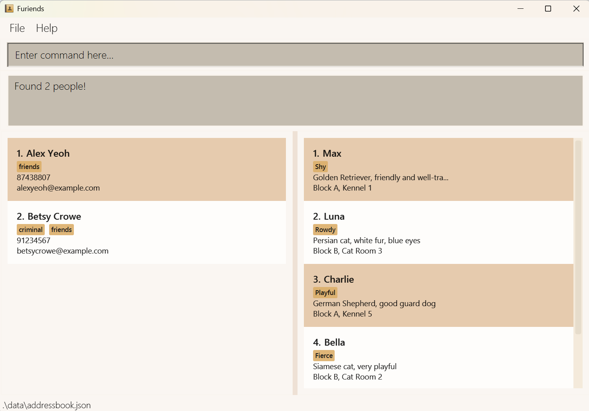
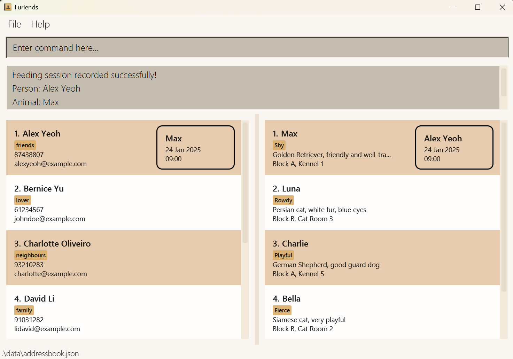

# Furiends User Guide

Furiends is a **desktop app tailored towards animal lovers, specifically individuals who are tasked to feed stray animals.** It is optimized for use via a **Command Line Interface** (CLI) while still having the benefits of a Graphical User Interface (GUI). If you can type fast, Furiends can help you manage people and animals. Furiends can also allocate people to certain animals for scheduled feeding, faster than traditional GUI apps.

## Table of Contents

- [Quick start](#quick-start)
- [Overview of GUI](#overview-of-gui)
- [Features](#features)
  - [Valid input formats](#valid-inputs-format)
  - [Viewing help : `help`](#viewing-help--help)
  - [Adding a person: `add person`](#adding-a-person-add-person)
  - [Adding an animal: `add animal`](#adding-an-animal-add-animal)
  - [Listing all contacts : `list`](#listing-all-contacts--list)
  - [Editing a person : `edit person`](#editing-a-person--edit-person)
  - [Editing an animal : `edit animal`](#editing-an-animal--edit-animal)
  - [Locating people by name: `find person`](#locating-people-by-name-find-person)
  - [Locating animals by name: `find animal`](#locating-animals-by-name-find-animal)
  - [Feeding an animal : `feed`](#feeding-an-animal--feed)
  - [Deleting a person : `delete person`](#deleting-a-person--delete-person)
  - [Deleting an animal : `delete animal`](#deleting-an-animal--delete-animal)
  - [Deleting a feeding session : `delete feed`](#deleting-a-feeding-session--delete-feed)
  - [Clearing all entries : `clear`](#clearing-all-entries--clear)
  - [Undoing the last change: `undo`](#undoing-the-last-change-undo)
  - [Redoing an undone change: `redo`](#redoing-an-undone-change-redo)
  - [Exiting the program : `exit`](#exiting-the-program--exit)
  - [Saving the data](#saving-the-data)
  - [Editing the data file](#editing-the-data-file)
- [FAQ](#faq)
- [Known issues](#known-issues)
- [Command summary](#command-summary)

--------------------------------------------------------------------------------------------------------------------

## Quick start

1. Ensure you have Java `17` or above installed in your Computer. 
   **Mac users:** Ensure you have the precise JDK version prescribed [here](https://se-education.org/guides/tutorials/javaInstallationMac.html).

2. Download the latest `.jar` file from [here](https://github.com/AY2526S1-CS2103T-W14-3/tp/releases).

3. Copy the file to the folder you want to use as the _home folder_ for your Furiends application.

4. Open a command terminal, `cd` into the folder you put the jar file in. 

   {style="width:750px; height:auto;"}
<box type="tip" seamless>

The file is usually in `downloads` after downloading it.
</box>

5. Use the `java -jar furiends.jar` command to run the application.  
   A GUI similar to the below should appear in a few seconds. Note how the app contains some sample data. 
   {style="width:650px; height:auto;"}  
   For more details on the GUI, refer to the [Overview of GUI](#overview-of-gui) section.  

5. Type the command in the command box (displaying "Enter command here...") and press Enter to execute it. 
   Some simple commands you can try:

   * `help` : Shows the help page with the full list of commands.

   * `list` : Lists all contacts.

   * `clear` : Deletes all contacts.

   * `exit` : Exits the app.

6. Refer to the [Features](#features) below for details of each command.

------------------------------------------------------------------------------------------------

## Overview of GUI
{style="width:500px; height:auto;"}

The GUI is made up of the following components:
1. **Options Panel**: Contains menu bars to exit (File > Exit) and open the help panel (Help > Help).
2. **Command Box**: Commands are entered in this text box. Press the Enter key to execute the command.
3. **Feedback Box**: The app displays the result of the executed command in this box.
4. **Person View**: Displays the list of people stored in Furiends.
5. **Animal View**: Displays the list of animals stored in Furiends.

------------------------------------------------------------------------------------------------

## Features

<box type="info" seamless>

**Notes about the command format:** 

* Words in `UPPER_CASE` are the parameters to be supplied by the user. 
  e.g. in `add person n/NAME...`, `NAME` is a parameter which can be used as `add person n/John Doe...`.
* Items in square brackets are optional. 
  e.g `n/NAME ... [t/TAG]` can be used as `n/John Doe ... t/friend` (friend tag added)
  or as `n/John Doe ... `(no tag provided).

* Items with `…` after them can be used multiple times, including zero times.  
  For example, `[t/TAG]…` can be omitted, used once as `t/friend`, or used multiple times as `t/friend t/family`.

* Parameters can be in any order. 
  e.g. if the command specifies `n/NAME p/PHONE_NUMBER`, `p/PHONE_NUMBER n/NAME` is also acceptable.

* Extraneous parameters for commands that do not take in parameters
  (such as `list`, `exit` and `clear`) will be ignored. 
  e.g. if the command specifies `list 123`, it will be interpreted as `list`.
</box>
<box type="warning" seamless>

If you are using a PDF version of this document, be careful when copying and pasting commands that span multiple lines as space characters surrounding line-breaks may be omitted when copied over to the application.
</box>

### Valid Inputs Format
* `NAME`/`PERSON_NAME`/`ANIMAL_NAME`
  * Can only contain letters (`A-Z` and `a-z` only).
  * Character limit of 1-30 (after removal of additional white spaces).
  * Person/animal names are unique, no duplicate names accepted. 
  * Case-insensitive. 
  <box type="tip" seamless>
  
    Input `john` is the same as `JOHN`.
  </box>

* `PHONE`
  * Can only contain digits `0-9`.
  * 8 digits strictly required.
  * The starting digit must be `6`, `8` or `9`, following a valid Singapore number format.
  * Phone numbers are unique, no duplicate numbers accepted.
  * e.g. `91234567`, `81234567`   

* `EMAIL`
  * Must adhere to the **RFC5322** email format:
  * `local-part@domain`
    * `local-part`: can have up to **64** letters, digits or special characters
    <box type="info" seamless>

    Periods `.` are allowed, but it **cannot** be at the start or the end of the `local-part`.
    </box>
  
    * `@`: must have separator symbol between `local-part` and `domain`
    * `domain`: maximum of **255 characters**, must follow domain naming conventions and 
    have a hierarchical structure of `example.com`
  * e.g. `johndoe@email.com`, `he.he_123@gotmail.com`
* `TAG`
  * Can only contain letters and digits.
  * Character limit of 30 (including all white spaces).
  * e.g. `fluffy fur`, `cutie12 3`, `barker`  
 
* `DATETIME`
  * Format: `YYYY-MM-DD HH:MM`
  * Must be a valid date and time. 
    * `YYYY`: 4 digits year (e.g. `2025`).
    * `MM`: 2 digits month (e.g. `March` is `03`) .
    * `DD`: 2 digits day (e.g. `28`).
    * `HH:MM`: 4 digits separated by `:` following the 24-hour clock (e.g. `7:05PM` is `19:05`)
  * Date and time is separated with **a single spacing**.
  * e.g. `2025-10-01 18:59`, `2005-04-25 07:05`   
* `DESCRIPTION`
  * Character limit of 200 (including internal white spaces).
  * e.g. `cat that bites,,, meow`, `too fat need lose weight!`   
* `LOCATION`
  * Character limit of 100 (including internal white spaces).
  * e.g. `AMK Street 3497`, `blk A7!`  
* `KEYWORD`
  * Comes in 2 different forms `n/NAME` and `t/TAG` only.
  * Characters length of 1-30 allowed after removal of extra white spaces.
  * Only alphabets `A–Z`, `a–z`, digits `0-9`, hyphens `-`, and spaces allowed.
  * e.g. `n/bobby`, `n/Je`, `t/fluffy`, `t/fluf`

--------------------------------------------------------------------------------------------------------------------

### Viewing help : `help`

Displays a window, which links to the user guide, as well as a list of commands.  

Format: `help [command]`  

The general help window (in the image below) can be opened by entering `help` in the command box.

{style="width:700px; height:auto;"}

Each command is clickable to open another window, which shows additional details regarding the command's usage.  

This window can also be opened by entering `help <command>` in the command box.  

In the example below, when clicking the `help` command (as shown in the image above), a new window will pop up to show
the details of the `help` command and its usage.
(The below window can also be opened by entering `help help` in the command box.)

{style="width:700px; height:auto;"}

Clicking on the command format template will copy the command format to the command box in the main application window
and close this window. For example, clicking on the command format template `help <command name>` will copy
the corresponding command format to the command box as shown below.

{style="width:700px; height:auto;"}  

### Adding a person: `add person`

Adds a person to Furiends.
Format: `add person n/NAME p/PHONE_NUMBER e/EMAIL [t/TAG]…​`

* You may assign any number of tags (including none) to a person.

Examples: refer to input restrictions [here](#valid-inputs-format)!
* `add person n/John Doe p/98765432 e/johnd@example.com`
* `add person n/Betsy Crowe t/friend e/betsycrowe@example.com p/91234567 t/criminal` 
{style="width:700px; height:auto;"}
  * new person contact card created:  
{style="width:400px; height:auto;"}

### Adding an animal: `add animal`

Adds an animal to Furiends.

Format: `add animal n/NAME d/DESCRIPTION l/LOCATION [t/TAG]…​`

Examples: refer to input restrictions [here](#valid-inputs-format)!
* `add animal n/Fluffy d/White cat l/Ang Mo Kio t/shy` 
{style="width:600px; height:auto;"}
  * new animal contact card created:  
{style="width:400px; height:auto;"}

### Listing all contacts : `list`

Shows a list of all people and animals in Furiends.

Format: `list`

### Editing a person : `edit person`

Edits an existing person in Furiends.

Format: `edit person NAME [n/NAME] [p/PHONE] [e/EMAIL] [t/TAG]… [f/ANIMAL_NAME dt/YYYY-MM-DD HH:MM]…​`

* Edits the person with the specified `NAME`. The name is **case-insensitive**.
* At least one of the optional fields must be provided.
* Existing values will be updated to the input values.
* **Only when editing tags**, the existing tags of the person will be removed. 
  * i.e adding of tags is not cumulative.
  
<box type="tip" seamless>

You can remove all the person’s tags by typing `t/` without
specifying any tags after it.
</box>

Examples: refer to input restrictions [here](#valid-inputs-format)!
*  `edit person Bernice Yu p/61234567 e/johndoe@example.com t/lover`  
   Edits the phone number and email address of the person with name `Bernice Yu` to be `61234567`
   and `johndoe@example.com` respectively.  
   `Bernice Yu` will now only have the new added tag, `lover`, instead of the original tags.
  * Before: {style="width:50%; height:auto;"} 
  * After :{style="width:50%; height:auto;"}
*  `edit person Betty Crower n/Betsy Crower t/`  
   Edits the name of `Betty Crower` to be `Betsy Crower` and clears all existing tags.

### Editing an animal : `edit animal`

Edits an existing animal in Furiends.

Format: `edit animal NAME [n/NAME] [d/DESCRIPTION] [l/LOCATION] [t/TAG]…​`

* Edits the animal with the specified `NAME`. The name is **case-insensitive**.
* At least one of the optional fields must be provided.
* Existing values will be updated to the input values.

Examples: refer to input restrictions [here](#valid-inputs-format)!
*  `edit animal Fluffy l/Void Deck` Edits the location of the animal with name `Fluffy` to be `Void Deck`.
*  `edit animal Kitty n/Catty t/` Edits the name of the animal with name `Kitty` to be `Catty` and clears all existing tags.

### Locating people by name: `find person`

Finds people whose names contain any of the given keywords.

Format: `find person KEYWORD [MORE_KEYWORDS]...`

* The search is **case-insensitive**. e.g `hans` will match `Hans`.
* The order of the keywords does not matter. e.g. `Hans Bo` will match `Bo Hans`.
* Only the name and tag (when specified) are searched.
* Substrings can be searched. e.g. `an` will match `Hans`, `Andy`.
* People's names matching at least one keyword will be returned (i.e. `OR` search).
  e.g. `Hans Bo` will return `Hans Gruber`, `Bo Yang`.
* Searching using tags must have the **exact case-insensitive spelling**. 
  e.g. `t/friends` will return the same result as `t/FRIENDS`.
  * Only people with the tag `friends` will be shown.
  <box type="info" seamless>
  
  People with the tag `friend` will not be shown as the spelling is not exactly the same.
  </box>

Examples: refer to input restrictions [here](#valid-inputs-format)!
* `find person n/alex n/dav` returns `Alex Yeoh`, `David Li`. Note that the 'animal' portion is still shown. 

  {style="width:800px; height:auto;"} 
* `find person t/friends` returns `Alex Yeoh`, `Betsy Crowe`. Note that the 'animal' portion is still shown. 

  {style="width:800px; height:auto;"} 
<box type="info" seamless>

After using `find` to filter out the contacts you want, you can use `list` to return
to full display of all contacts. [Find out how!](#listing-all-people--list)
</box>

### Locating animals by name: `find animal`

Finds animals whose names contain any of the given keywords.

Format: `find animal KEYWORD [MORE_KEYWORDS]...`

* The search is **case-insensitive**. e.g `fluffy` will match `Fluffy`.
* The order of the keywords does not matter. e.g. `Cutie Pie` will match `Pie Cutie`.
* Only the name and tag (when specified) are searched.
* Substrings can be matched e.g. `Fluff` will match `Fluffy` and `Kerfluff`.
* Animals' name matching at least one keyword will be returned (i.e. `OR` search).
  e.g. `n/Cutie` will return `Cutie Pie`, `Cutie Patootie` (if both animals are stored in the application).
* Searching using tags must have the **exact case-insensitive spelling**. 
  e.g. `t/fur` will return the same result as `t/FUR`.
  * Only aniamls with the tag `fur` will be shown. 

Examples: refer to input restrictions [here](#valid-inputs-format)!
* `find animal n/max n/luna` returns `Max`, `Luna`. Note that the 'person' portion is still shown. 

  {style="width:800px; height:auto;"}

<box type="info" seamless>

After using `find` to filter out the contacts you want, you can use `list` to return 
to full display of all contacts. [Find out how!](#listing-all-people--list)
</box>

### Feeding an animal : `feed`
Records a feeding session between an animal and a person (feeder) in Furiends.

Format: `feed f/PERSON_NAME n/ANIMAL_NAME dt/DATETIME`

* **1 feeding session** can only involve **1 animal** and **1 person**.
* An animal can have **more than 1 feeding sessions**.  
  E.g. `Max` can have 2 different feeding sessions, 1 with `Alex Yeoh` and 1 with `Bernice Yu`.
  * `Max` is being fed by 2 different people.
* 1 person can feed **more than 1 animal**.  
  E.g. `Alex Yeoh` can 2 different have feeding sessions, 1 with `Max` and 1 with `Luna`.
  * `Alex Yeoh` is feeding 2 different animals.
* `DATETIME` must be a valid day and time.
* The order of `n/ANIMAL_NAME`, `f/PERSON_NAME` and `dt/DATETIME` does not matter.

Examples: refer to input restrictions [here](#valid-inputs-format)!
* `feed f/Alex Yeoh n/Max dt/2025-01-24 09:00` will assign `Alex Yeoh` and `Max` to the same feeding session.  

  {style="width:800px; height:auto;"} 

### Deleting a person : `delete person`

Deletes the specified person from Furiends.

Format: `delete person n/NAME`

* Deletes the person with the specified `NAME`.
* The name is **case-insensitive**.

Examples: refer to input restrictions [here](#valid-inputs-format)!
* `delete person n/Alex Yeoh` Deletes the person with name `Alex Yeoh` from Furiends.
  * Feedback Box:  
  {style="width:900px; height:auto;"} 

### Deleting an animal : `delete animal`

Deletes the specified animal from Furiends.

Format: `delete animal n/NAME`

* Deletes the animal with the specified `NAME`.
* The name is **case-insensitive**.

Examples: refer to input restrictions [here](#valid-inputs-format)!
* `delete animal n/Max` Deletes the animal with name `Max` from Furiends.
  * Feedback Box:  
  {style="width:900px; height:auto;"} 

### Deleting a feeding session : `delete feed`
Deletes a specified feeding session from Furiends.

Format: `delete feed n/ANIMAL_NAME f/PERSON_NAME dt/DATETIME`

* Deletes the feeding session that corresponds to the same person, animal and feeding time.
* The names are **case-insensitive**.
* `DATETIME` must be a valid day and time.
* The order of `n/ANIMAL_NAME`, `f/PERSON_NAME` and `dt/DATETIME` does not matter.

Examples: refer to input restrictions [here](#valid-inputs-format)!
* `delete feed n/Max f/Alex Yeoh dt/2025-01-24 09:00` Deletes the feeding session between `Max` and `Alex Yeoh` at `24 Jan 2025 09:00` from Furiends.
  * Feedback Box:  
    {style="width:700px; height:auto;"} 

### Clearing all entries : `clear`

Clears all entries from Furiends.

Format: `clear`

### Undoing the last change: `undo`

Reverts Furiends to its previous state before the last modifying command.

Format: `undo`

* Only works for commands that change Furiends (e.g., add, edit, delete).
* If there are no changes to undo, an error message will be shown.

Example:
* `undo` Reverts the last add, edit, or delete command.

### Redoing an undone change: `redo`

Restores Furiends to the state before the last undo command.

Format: `redo`

* Only works immediately after an `undo` command.
* If there are no changes to redo, an error message will be shown.

Example:
* `redo` Re-applies the last change that was undone.

### Exiting the program : `exit`

Exits the program.

Format: `exit`

<box type="tip" seamless>
You can also close the main window of GUI, by clicking on the cross at the top right hand corner, to close the whole program.
</box>

### Saving the data

Furiends data are saved in the hard disk automatically after any command that changes the data. There is no need to save manually.

### Editing the data file

Furiends data are saved automatically as a JSON file `[JAR file location]/data/addressbook.json`. Advanced users are welcome to update data directly by editing that data file.

<box type="warning" seamless>

**Caution:**
If your changes to the data file makes its format invalid, Furiends will discard all data and start with an empty data file at the next run.  Hence, it is recommended to take a backup of the file before editing it. 
Furthermore, certain edits can cause Furiends to behave in unexpected ways (e.g., if a value entered is outside the acceptable range). Therefore, edit the data file only if you are confident that you can update it correctly.
</box>

------------------------------------------------------------------------------------------------

## FAQ

**Q**: How do I transfer my data to another Computer? 
**A**: Install the app in the other computer and overwrite the empty data file it creates with the file that contains 
the data of your previous Furiends home folder. 
**Q**: How do I restore all the contacts after using `find` to filter? 
**A**: In the command input, enter `list` to view all contacts. 

------------------------------------------------------------------------------------------------

## Known issues

1. **When using multiple screens**, if you move the application to a secondary screen, and later switch to using only the primary screen, the GUI will open off-screen. The remedy is to delete the `preferences.json` file created by the application before running the application again.
2. **If you minimize the Help Window** and then run the `help` command (or use the `Help` menu, or the keyboard shortcut `F1`) again, the original Help Window will remain minimized, and no new Help Window will appear. The remedy is to manually restore the minimized Help Window.

------------------------------------------------------------------------------------------------

## Command summary

Action (in alphabetical order) | Format, Examples
----------------------|------------------------------------------------------------------------------------------------
**Add Animal**                 | `add animal n/NAME d/DESCRIPTION l/LOCATION [t/TAG]…​`   e.g., `add animal n/Fluffy d/White cat l/Ang Mo Kio`
**Add Person**                 | `add person n/NAME p/PHONE_NUMBER e/EMAIL [t/TAG]…​` e.g.,`add person n/James Ho p/92224444 e/jamesho@example.com a/123, Clementi Rd, 1234665 t/friend t/colleague`
**Clear**                      | `clear`
**Delete Animal**              | `delete animal n/NAME`  e.g., `delete animal n/Fluffy`
**Delete Feed**                | `delete feed n/ANIMAL_NAME f/PERSON_NAME dt/DATETIME`  e.g., `delete feed n/Fluffy f/John Doe dt/2005-04-09 10:00`
**Delete Person**              | `delete person n/NAME`  e.g., `delete person n/John Doe`
**Edit Animal**                | `edit animal NAME [n/NAME] [d/DESCRIPTION] [l/LOCATION] [t/TAG]…`  e.g., `edit animal Fluffy l/Void Deck`
**Edit Person**                | `edit person NAME [n/NAME] [p/PHONE] [e/EMAIL] [t/TAG]… [f/ANIMAL_NAME dt/YYYY-MM-DD HH:MM]…​`  e.g.,`edit person John Doe n/James Lee e/jameslee@example.com`
**Exit**                       | `exit`
**Feed**                       | `feed f/PERSON_NAME n/ANIMAL_NAME dt/DATETIME`  e.g., `feed n/Fluffy f/John Doe dt/2005-04-09 10:00`
**Find Animal**                | `find animal KEYWORD [MORE_KEYWORDS]`  e.g., `find n/Fluffy n/Max 
**Find Person**                | `find person KEYWORD [MORE_KEYWORDS]`  e.g., `find n/James t/family`t/cute`
**Help**                       | `help [COMMAND]`  e.g. `help`   e.g. `help add person`
**List**                       | `list`
**Redo**                       | `redo`
**Undo**                       | `undo`
